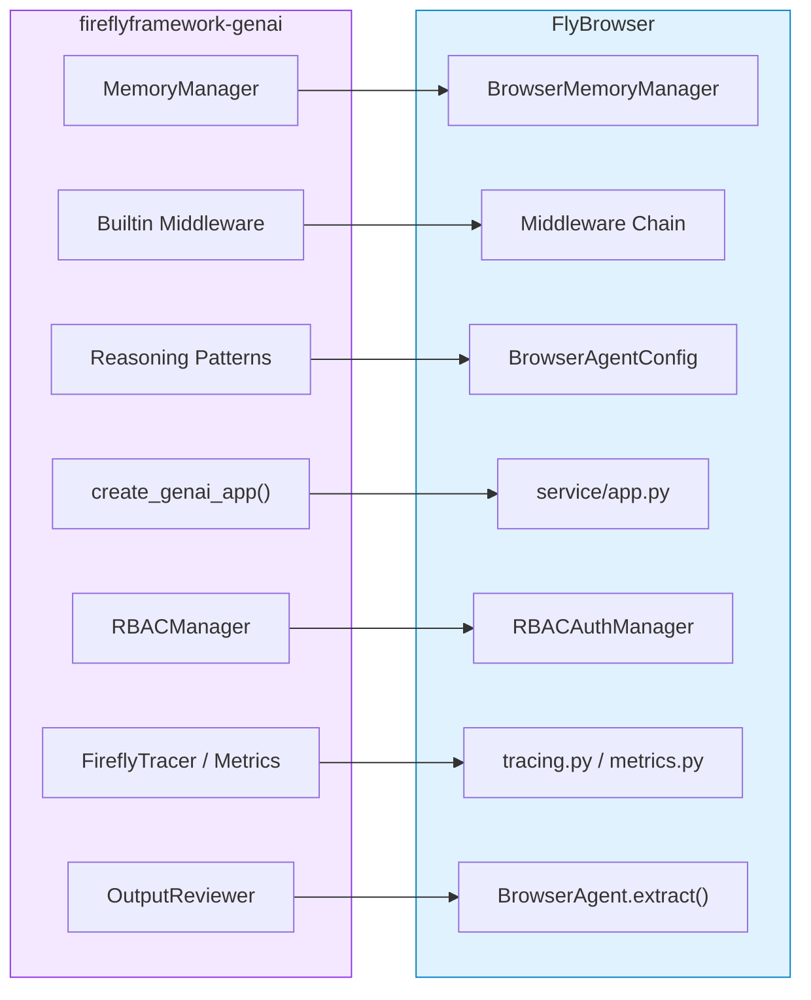
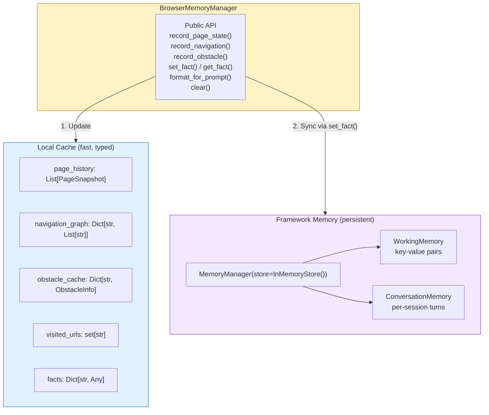
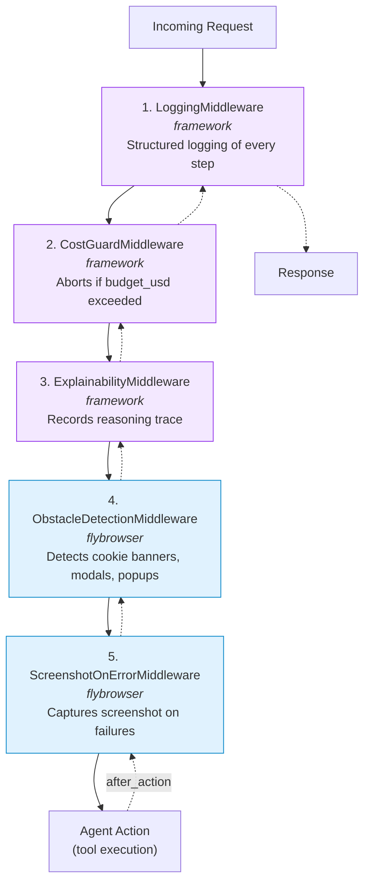
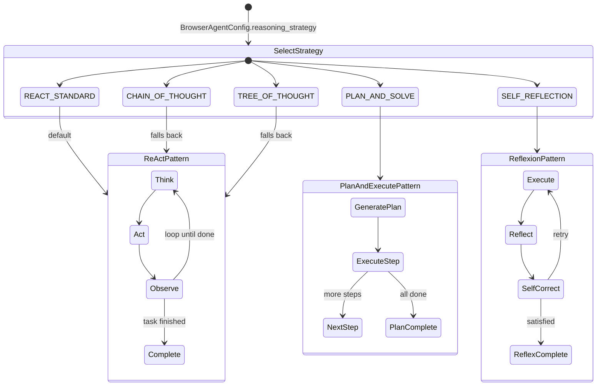
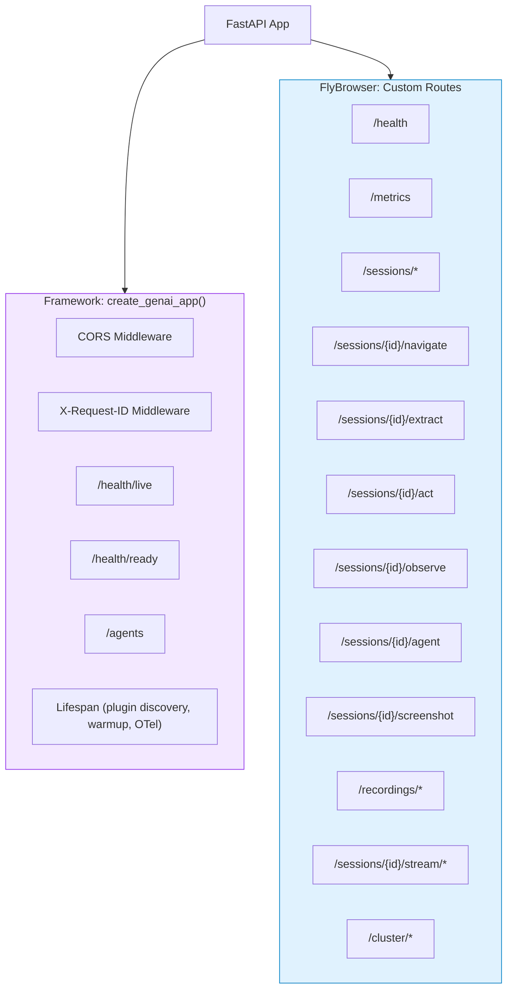
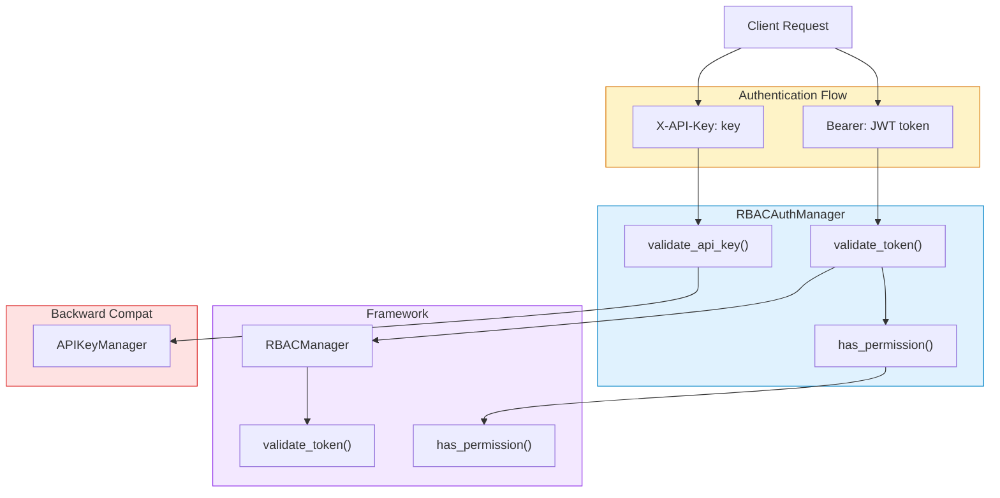
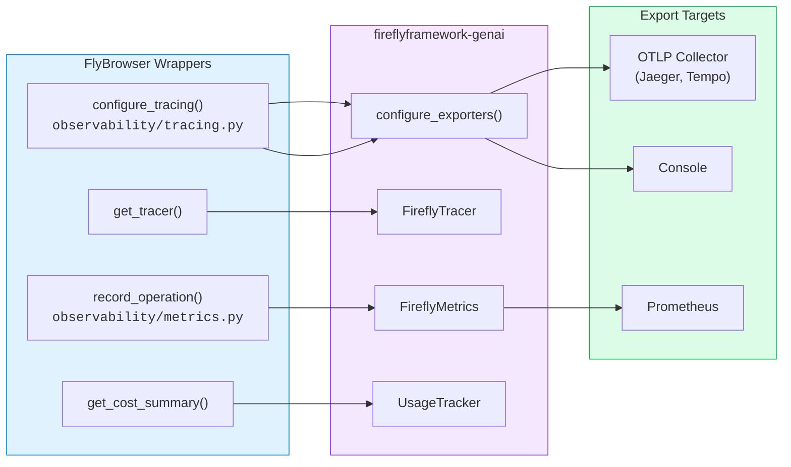
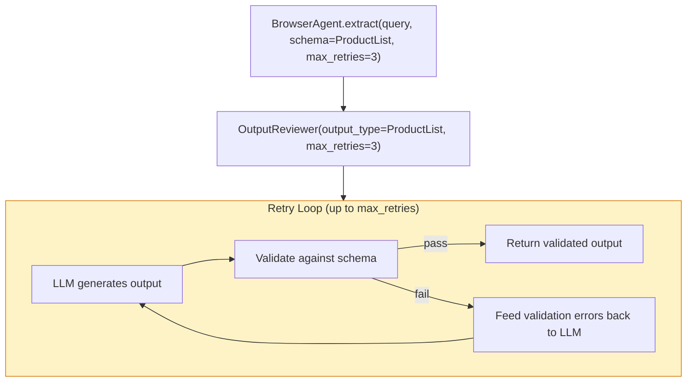

<!--
Copyright 2026 Firefly Software Solutions Inc

Licensed under the Apache License, Version 2.0 (the "License");
you may not use this file except in compliance with the License.
You may obtain a copy of the License at

    http://www.apache.org/licenses/LICENSE-2.0

Unless required by applicable law or agreed to in writing, software
distributed under the License is distributed on an "AS IS" BASIS,
WITHOUT WARRANTIES OR CONDITIONS OF ANY KIND, either express or implied.
See the License for the specific language governing permissions and
limitations under the License.
-->

# Framework Integration

FlyBrowser delegates core AI infrastructure to **fireflyframework-genai**, Firefly's shared GenAI framework. This document describes how each framework subsystem is integrated, how data flows through each boundary, and how to configure every integration point.

---

## 1. Overview

The framework provides seven capabilities that FlyBrowser consumes. Every integration follows the same pattern: FlyBrowser imports a framework primitive, wraps or configures it with browser-specific concerns, and exposes a higher-level API to the rest of the codebase.

| # | Capability | Framework Module | FlyBrowser Integration Point |
|---|-----------|-----------------|------------------------------|
| 1 | Memory | `fireflyframework_genai.memory` | `BrowserMemoryManager` in `agents/memory/browser_memory.py` |
| 2 | Middleware | `fireflyframework_genai.agents.builtin_middleware` | Middleware chain in `BrowserAgent.__init__` |
| 3 | Reasoning | `fireflyframework_genai.reasoning` | `BrowserAgentConfig.reasoning_strategy` |
| 4 | REST exposure | `fireflyframework_genai.exposure.rest` | `create_genai_app()` in `service/app.py` |
| 5 | Security | `fireflyframework_genai.security.rbac` | `RBACAuthManager` in `service/auth.py` |
| 6 | Observability | `fireflyframework_genai.observability` | `tracing.py` and `metrics.py` in `observability/` |
| 7 | Validation | `fireflyframework_genai.validation` | `OutputReviewer` in `BrowserAgent.extract()` |



---

## 2. Memory Subsystem

### Dual-Write Architecture

`BrowserMemoryManager` wraps the framework's `MemoryManager` with a **dual-write** pattern. Every mutation updates two stores simultaneously:

1. **Local Python caches** -- `PageSnapshot`, `ObstacleInfo`, navigation graph, visited URLs, and user-set facts. These provide fast, typed access without serialization overhead.
2. **Framework `WorkingMemory`** -- The same data, serialized as dictionaries, is persisted through `MemoryManager.set_fact()`. This enables future migration to persistent backends with zero code changes.



### Reserved Keys

Five keys are reserved for internal browser state and cannot be used with `set_fact()`:

| Key | Contents | Updated by |
|-----|----------|-----------|
| `page_history` | Serialized list of `PageSnapshot` dicts | `record_page_state()` |
| `visited_urls` | List of all visited URL strings | `record_page_state()` |
| `current_page` | `{url, title}` of the current page | `record_page_state()` |
| `navigation_graph` | `{from_url: [to_url, ...]}` adjacency list | `record_navigation()` |
| `obstacle_cache` | `{url: {obstacle_type, resolution}}` | `record_obstacle()` |

### Usage

```python
from flybrowser.agents.memory.browser_memory import BrowserMemoryManager

memory = BrowserMemoryManager()

# Every mutation writes to both local cache and framework
memory.record_page_state("https://example.com", "Example", "3 links, 1 form")
memory.record_navigation("https://google.com", "https://example.com", "click")
memory.record_obstacle("https://example.com", "cookie_banner", "dismissed")
memory.set_fact("login_status", "authenticated")

# Reads come from local cache (fast, typed)
page = memory.get_current_page()         # -> PageSnapshot
visited = memory.has_visited_url("...")   # -> bool

# Prompt context merges both sources
context = memory.format_for_prompt()
```

### Backend Pluggability

The `MemoryManager` accepts any store that implements the framework's store interface:

| Store | Module | Use Case |
|-------|--------|----------|
| `InMemoryStore` | `fireflyframework_genai.memory.store` | Default, no persistence |
| `FileStore` | `fireflyframework_genai.memory.store` | Local file-based persistence |
| `PostgresStore` | `fireflyframework_genai.memory.store` | Production distributed persistence |

To switch backends, modify the `BrowserMemoryManager.__init__` to inject a different store:

```python
from fireflyframework_genai.memory.store import PostgresStore

# In BrowserMemoryManager.__init__:
self._framework_memory = MemoryManager(store=PostgresStore(dsn="postgres://..."))
```

---

## 3. Middleware Pipeline

`BrowserAgent` assembles a five-layer middleware chain from both framework and FlyBrowser-specific middleware. Every agent action passes through the entire chain in order, both before and after execution.



| # | Middleware | Source | What it does | Configuration |
|---|-----------|--------|-------------|---------------|
| 1 | `LoggingMiddleware` | framework | Emits structured log entries for every tool call, including input parameters and result status. | None (always active) |
| 2 | `CostGuardMiddleware` | framework | Tracks accumulated token cost across all LLM calls. Raises an exception when the budget is exceeded, preventing runaway spending. | `BrowserAgentConfig.budget_limit_usd` (default: `5.0`) |
| 3 | `ExplainabilityMiddleware` | framework | Records a full reasoning trace (thought, action, observation) for post-hoc analysis and debugging. | None (always active) |
| 4 | `ObstacleDetectionMiddleware` | flybrowser | After each action, checks if the page contains obstacles (cookie banners, modals, CAPTCHA walls). When detected, it injects resolution actions. | Receives `PageController` at construction time |
| 5 | `ScreenshotOnErrorMiddleware` | flybrowser | When any tool raises an exception, captures a screenshot of the current browser state for debugging. | Receives `PageController` at construction time |

### Adding Custom Middleware

Framework middleware must implement the `AbstractMiddleware` interface:

```python
from fireflyframework_genai.agents.middleware import AbstractMiddleware

class MyCustomMiddleware(AbstractMiddleware):
    async def before_action(self, context):
        # Runs before each agent action
        pass

    async def after_action(self, context, result):
        # Runs after each agent action
        return result
```

---

## 4. Reasoning Patterns

`BrowserAgent` supports multiple reasoning strategies from the framework, selected via `BrowserAgentConfig.reasoning_strategy`. The `ReasoningStrategy` enum defines five values, three of which map to instantiated framework patterns:



### Strategy Comparison

| Strategy | Framework Class | Loop | Best for | Trade-offs |
|----------|----------------|------|----------|------------|
| `REACT_STANDARD` (default) | `ReActPattern` | Think-Act-Observe | Most browser tasks; adapts as the page changes | Balanced cost/accuracy |
| `PLAN_AND_SOLVE` | `PlanAndExecutePattern` | Plan upfront, then execute steps | Well-defined multi-step workflows (e.g., fill a 10-field form) | Higher initial cost, more predictable execution |
| `SELF_REFLECTION` | `ReflexionPattern` | Execute, reflect, self-correct | Tasks where first attempts may fail (e.g., navigating complex SPAs) | More LLM calls, better recovery from errors |
| `CHAIN_OF_THOUGHT` | `ReActPattern` (fallback) | Same as ReAct | -- | Defined in enum but currently maps to ReAct |
| `TREE_OF_THOUGHT` | `ReActPattern` (fallback) | Same as ReAct | -- | Defined in enum but currently maps to ReAct |

> **Note**: All patterns respect `max_iterations` and `max_time` from `BrowserAgentConfig`. The `CostGuardMiddleware` also applies across all patterns.

### Configuration

```python
from flybrowser.agents.browser_agent import BrowserAgentConfig
from flybrowser.agents.types import ReasoningStrategy

# Default ReAct
config = BrowserAgentConfig(reasoning_strategy=ReasoningStrategy.REACT_STANDARD)

# Plan-and-Execute for complex multi-step tasks
config = BrowserAgentConfig(reasoning_strategy=ReasoningStrategy.PLAN_AND_SOLVE)

# Reflexion for tasks requiring self-correction
config = BrowserAgentConfig(reasoning_strategy=ReasoningStrategy.SELF_REFLECTION)
```

The pattern is instantiated in `BrowserAgent._create_reasoning_pattern()`:

```python
@staticmethod
def _create_reasoning_pattern(config: BrowserAgentConfig) -> AbstractReasoningPattern:
    strategy = config.reasoning_strategy
    if strategy == ReasoningStrategy.PLAN_AND_SOLVE:
        return PlanAndExecutePattern(max_steps=config.max_iterations)
    if strategy == ReasoningStrategy.SELF_REFLECTION:
        return ReflexionPattern(max_steps=config.max_iterations)
    # REACT_STANDARD and any other strategy default to ReAct
    return ReActPattern(max_steps=config.max_iterations)
```

---

## 5. REST Exposure

The API server uses `create_genai_app()` from the framework instead of plain FastAPI. This factory provides a fully configured FastAPI application with standard GenAI infrastructure out of the box.



### Framework-Provided Endpoints

| Endpoint | Method | Description |
|----------|--------|-------------|
| `/health/live` | GET | Kubernetes liveness probe |
| `/health/ready` | GET | Kubernetes readiness probe |
| `/agents` | GET | List registered agents |

### Lifespan Composition

FlyBrowser composes its own lifespan (session manager, streaming, recording initialization) with the framework's lifespan (plugin discovery, warmup, OpenTelemetry setup):

```python
# service/app.py
app = create_genai_app(title="FlyBrowser", version=__version__, cors=True, request_id=True)

# Compose framework lifespan + FlyBrowser lifespan
_framework_lifespan = app.router.lifespan_context

@asynccontextmanager
async def _composed_lifespan(app_: FastAPI):
    async with _framework_lifespan(app_):
        async with lifespan(app_):
            yield

app.router.lifespan_context = _composed_lifespan
```

---

## 6. Security

### RBAC Architecture

`RBACAuthManager` wraps the framework's `RBACManager` to provide JWT-based access control with three built-in roles. It also maintains backward compatibility with API key authentication through an internal `APIKeyManager`.



### Roles and Permissions

| Role | Permissions | Description |
|------|------------|-------------|
| `admin` | `*` (wildcard) | Full access to all operations |
| `operator` | `sessions.create`, `sessions.delete`, `sessions.list`, `sessions.get`, `sessions.navigate`, `sessions.extract`, `sessions.act`, `sessions.agent`, `sessions.screenshot`, `sessions.observe`, `sessions.stream`, `recordings.list`, `recordings.download` | Create, use, and manage sessions; view recordings |
| `viewer` | `sessions.list`, `sessions.get`, `recordings.list`, `recordings.download` | Read-only access to sessions and recordings |

### Usage

```python
from flybrowser.service.auth import RBACAuthManager

mgr = RBACAuthManager(jwt_secret="your-secret-key")

# Create a token
token = mgr.create_token(user_id="alice", roles=["operator"])

# Validate a token
claims = mgr.validate_token(token)
# -> {"user_id": "alice", "roles": ["operator"], "exp": ...}

# Check permissions
mgr.has_permission("operator", "sessions.create")  # True
mgr.has_permission("viewer", "sessions.create")    # False
```

> **Note**: In development, `RBACAuthManager` generates a random JWT secret if none is provided. Production deployments should inject a real secret via configuration or environment variable.

---

## 7. Observability

FlyBrowser integrates three framework observability primitives through thin wrapper modules. This keeps framework imports out of the rest of the codebase and provides sensible defaults.



### Tracing

`FireflyTracer` wraps OpenTelemetry with a simplified API. Spans created by the tracer propagate through the entire middleware and tool execution pipeline.

```python
from flybrowser.observability.tracing import configure_tracing, get_tracer

# Configure at startup (optional -- defaults to no-op if not called)
configure_tracing(otlp_endpoint="http://localhost:4317", console=True, service_name="flybrowser")

# Use anywhere
tracer = get_tracer()
with tracer.custom_span("navigate"):
    await page.goto(url)
```

### Metrics and Cost Tracking

`FireflyMetrics` records latency histograms and token counters. `UsageTracker` provides per-session and global cost aggregation.

```python
from flybrowser.observability.metrics import record_operation, get_cost_summary

# Record an operation
record_operation("extract", latency_ms=1200, tokens=500, cost_usd=0.02)

# Get cumulative cost
summary = get_cost_summary()
# -> {"total_cost_usd": 1.42, "total_tokens": 35000}
```

| Component | Framework Class | What it records |
|-----------|----------------|----------------|
| Tracing | `FireflyTracer` | Distributed spans (OTLP/gRPC or console) |
| Metrics | `FireflyMetrics` | Latency histograms, token counters, cost gauges (Prometheus) |
| Cost tracking | `UsageTracker` | Per-session and global `total_cost_usd`, `total_tokens` |

---

## 8. Validation (OutputReviewer)

The `OutputReviewer` from the framework validates and retries LLM extraction results against a Pydantic schema. `BrowserAgent.extract()` uses it automatically when a `schema` parameter is provided.



### How It Works

1. `extract()` checks if a `schema` is provided.
2. If yes, it creates an `OutputReviewer(output_type=schema, max_retries=max_retries)`.
3. The reviewer calls `self._agent` with the extraction prompt.
4. The LLM response is validated against the Pydantic schema.
5. On validation failure, the errors are fed back to the LLM for a corrected attempt.
6. This repeats up to `max_retries` times (default 3).

### Usage

```python
from pydantic import BaseModel
from typing import List

class Product(BaseModel):
    name: str
    price: float

class ProductList(BaseModel):
    products: List[Product]

# Schema-validated extraction with automatic retries
result = await agent.extract(
    query="Get all products with names and prices",
    schema=ProductList,
    max_retries=3,
)
```

When no schema is provided, `extract()` runs a standard LLM call without validation:

```python
# No schema -- returns unstructured text
result = await agent.extract(query="What is the page title?")
```

---

## 9. Integration Summary

This table provides a single reference for every framework integration point, the exact import path, and where it is wired in FlyBrowser.

| Capability | Framework Import | FlyBrowser File | Wiring Location |
|-----------|-----------------|-----------------|-----------------|
| Agent orchestration | `fireflyframework_genai.agents.FireflyAgent` | `agents/browser_agent.py` | `BrowserAgent.__init__` |
| Logging middleware | `fireflyframework_genai.agents.builtin_middleware.LoggingMiddleware` | `agents/browser_agent.py` | `self._middleware[0]` |
| Cost guard middleware | `fireflyframework_genai.agents.builtin_middleware.CostGuardMiddleware` | `agents/browser_agent.py` | `self._middleware[1]` |
| Explainability middleware | `fireflyframework_genai.agents.builtin_middleware.ExplainabilityMiddleware` | `agents/browser_agent.py` | `self._middleware[2]` |
| ReAct reasoning | `fireflyframework_genai.reasoning.ReActPattern` | `agents/browser_agent.py` | `_create_reasoning_pattern()` |
| Plan-and-Execute reasoning | `fireflyframework_genai.reasoning.PlanAndExecutePattern` | `agents/browser_agent.py` | `_create_reasoning_pattern()` |
| Reflexion reasoning | `fireflyframework_genai.reasoning.ReflexionPattern` | `agents/browser_agent.py` | `_create_reasoning_pattern()` |
| Output validation | `fireflyframework_genai.validation.OutputReviewer` | `agents/browser_agent.py` | `extract()` method |
| ToolKit base class | `fireflyframework_genai.tools.toolkit.ToolKit` | `agents/toolkits/__init__.py` | All 6 toolkit factories |
| Memory management | `fireflyframework_genai.memory.MemoryManager` | `agents/memory/browser_memory.py` | `BrowserMemoryManager.__init__` |
| Memory store | `fireflyframework_genai.memory.store.InMemoryStore` | `agents/memory/browser_memory.py` | `BrowserMemoryManager.__init__` |
| REST app factory | `fireflyframework_genai.exposure.rest.create_genai_app` | `service/app.py` | Module-level `app` creation |
| RBAC manager | `fireflyframework_genai.security.rbac.RBACManager` | `service/auth.py` | `RBACAuthManager.__init__` |
| Tracer | `fireflyframework_genai.observability.FireflyTracer` | `observability/tracing.py` | `configure_tracing()` / `get_tracer()` |
| Exporter config | `fireflyframework_genai.observability.exporters.configure_exporters` | `observability/tracing.py` | `configure_tracing()` |
| Metrics | `fireflyframework_genai.observability.FireflyMetrics` | `observability/metrics.py` | `get_metrics()` |
| Usage tracking | `fireflyframework_genai.observability.UsageTracker` | `observability/metrics.py` | `get_usage_tracker()` |

---

## See Also

- [Architecture Overview](overview.md) -- High-level system architecture and deployment modes
- [Memory System](memory.md) -- BrowserMemoryManager internals
- [Security Architecture](security.md) -- RBAC roles, JWT lifecycle, and API key management
- [Observability](../features/observability.md) -- Tracing, metrics, and live view setup
- [ReAct Framework](react.md) -- Reasoning pattern details and customization
- [Tools System](tools.md) -- ToolKit architecture and individual tool reference
